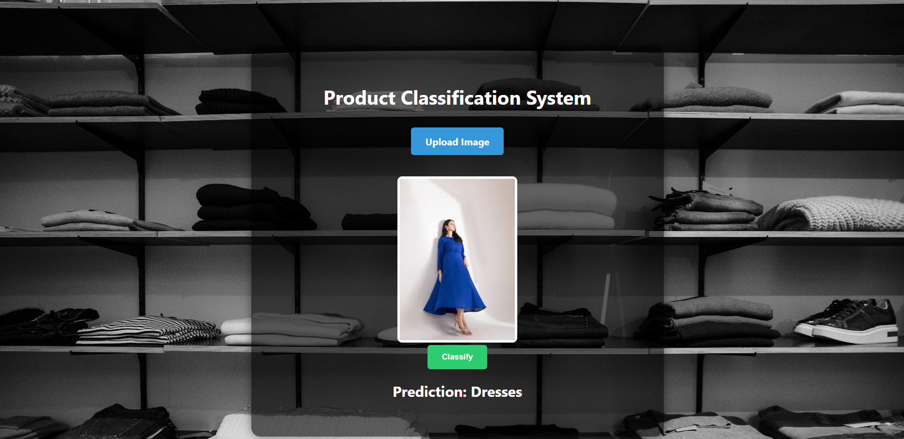

# 🧠 Product Image Classification System

This project is a deep learning-based image classification system that predicts the category of fashion products from images. Built with a user-friendly **Flask** web interface, it allows users to upload product images and get real-time predictions. The model is trained using **PyTorch** on a labeled fashion dataset.

---

## Demo



---

## 🎯 Features

* Classifies images into multiple fashion product categories:

  * T-shirts
  * Dresses
  * Jeans
  * Shorts
  * Heels
  * Sandals
* Easy-to-use web interface (Flask)
* Real-time image classification
* Responsive UI for quick testing
* Easily extendable for more categories

---

## 🧠 Model Info

* Deep Convolutional Neural Network (CNN) built with **PyTorch**
* Trained on a curated **Fashion Product Image Dataset**
* Optimized with data augmentation and dropout for better generalization
* Achieves high accuracy on validation set

---

## 💻 Tech Stack

Python 3.10+ – Core programming language
PyTorch – Model creation, training, and inference
TorchVision – Image transformations like resizing, normalization, etc.
Flask – Web framework to build and run the user-facing web app
Jinja2 – Templating engine used via Flask for rendering HTML
Pillow (PIL) – Image loading and format conversion in the web app
HTML / CSS – Basic frontend styling (in templates/ and static/)
OS – Used for file system operations (creating directories, paths, etc.)

---

## 🚀 How to Use

1. Launch the web app:

   ```bash
   python app.py
   ```
2. Open your browser and go to: [http://127.0.0.1:5000/](http://127.0.0.1:5000/)
3. Upload an image of a product
4. Click **Classify**
5. View the predicted product category instantly!

---

## 🌐 Deployment

Live Demo: [https://product-classifier-63lq.onrender.com](https://product-classifier-63lq.onrender.com)

---

## 📦 Installation (for Local Use)

1. Clone the repository:

   ```bash
   git clone https://github.com/yourusername/Product_Classifier.git
   cd Product_Classifier
   ```

2. Install the dependencies:

   ```bash
   pip install -r requirements.txt
   ```

3. Run the app:

   ```bash
   python app.py
   ```

---

## 📁 Project Structure

```
Product_Classifier/
├── app.py                  # Flask web application
├── model.pth               # Trained PyTorch model
├── static/                 # CSS & uploaded images
├── templates/              # HTML templates
├── utils.py                # Image preprocessing and model prediction
├── requirements.txt        # Python dependencies
├── README.md               # Project overview
```

---

## 👩‍💻 Author

**Insiya Fakhruddin**
AI & Deep Learning Enthusiast
[GitHub](https://github.com/InsiyaFakhruddin)

---

## 📜 License

This project is licensed under the **MIT License** – feel free to use, modify, and distribute.

---

## 🙏 Acknowledgements

* Dataset: Fashion Product Images (public dataset)
* PyTorch for deep learning framework
* Flask for seamless deployment
